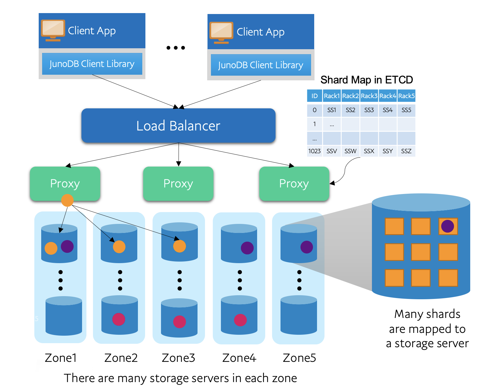

# JunoDB - A secure, consistent and highly available key-value store

[](http://www.apache.org/licenses/LICENSE-2.0.txt)
[](https://github.com/paypal/junoDB/actions/workflows/juno_server_bin_build.yml)
[](https://github.com/paypal/junoDB/actions/workflows/juno_server_docker_build.yml)


## What is JunoDB
JunoDB is PayPal's home-grown Secure, consistent and highly available key-value store providing low, single digit millisecond, latency at any scale. 

<details>
  <summary>JunoDB high level architecture</summary>
   


</details>

When a client wants to store a (key, value) pair in JunoDB, Proxy writes the key in 3 out of 5 shards in the storage server. The shard-map is stored in the etcd.

JunoDB therefore works using three main components, the ETCD, storage server and proxy. 

</details>
<br>


## Getting Started with the JunoDB Server

### Clone the repository from [github](https://github.com/paypal/junodb)

```bash
git clone https://github.com/paypal/junodb.git
```

### Set BUILDTOP variable

```bash
export BUILDTOP=<path_to_junodb_folder>/junodb
cd $BUILDTOP
```

Continue building JunoDB server with 
1. [Docker build](#docker-build) or 
2. [Manual build](#manual-build) 
<br>

## Docker Build

* [Docker](#docker-build)    
    * [Install Dependencies](#docker_install_dependencies)
    * [Build JunoDB](#docker_build_junodb)
    * [Run JunoDB](#docker_run_junodb)
    * [Generate Secrets for Dev](#docker_secrets)
    * [Validate JunoDB](#docker_validate_junodb)


<!-- toc -->

### <h3 id="docker_install_dependencies">Install Dependencies</h3>
[Install Docker Engine version 20.10.0+](https://docs.docker.com/engine/install/ubuntu/)
Check for existing docker version
```bash
docker version
```

Install Docker if not installed or version is older than 20.10.0
```bash
./docker/setup.sh
#If you are not already added to the docker group before running ./setup.sh, you will have to restart your machine for this change to have effect
```

### <h3 id="docker_build_junodb">Build JunoDB</h3>
```bash
#Login to docker hub account 
docker login

# Build junodb docker images
#junoclusterserv
#junoclustercfg
#junoserv
#junostorageserv
docker/build.sh 
```

### <h3 id="docker_run_junodb">Run JunoDB</h3>
```bash
# Setup junodb network and start junodb services
#junoclusterserv
#junoclustercfg
#junostorageserv
#junoserv

# JunoDB proxy service listens on port 
# :5080 TLS and :8080 TCP
docker/start.sh 

```

### Shutdown JunoDB services
```bash
# This will shutdown junodb services
#junoclusterserv
#junoclustercfg
#junostorageserv
#junoserv
docker/shutdown.sh 

```

### Manually Run JunoDB services
```bash
#This can be done instead of ./start.sh to start up the docker services

cd $BUILDTOP/docker/manifest

# To run junodb services in --detach mode (recommended)
docker compose up -d

# Juno proxy service listens on port 
# :5080 TLS and :8080 TCP

#To view the running containers 
docker ps

# To stop junodb services
docker compose down
```
### <h3 id="docker_secrets">Generate Secrets for Dev</h3>

<br>

> **_NOTE:_**  secrets for TLS and Encryption can be generated for dev/testing.
```bash 
sh $BUILDTOP/docker/manifest/config/secrets/gensecrets.sh

## generated secrets
# server.crt/server.pem - certificate/key for junodb proxy for TLS 
# ca.crt - CA cert
# keystore.toml - sample keystore file
```


### <h3 id="docker_validate_junodb">Validate JunoDB</h3>

Login to docker client and check connection with proxy
```bash 
docker exec -it junoclient bash -c 'nc -vz proxy 5080'
```


<br>

### You can also test the junodb server by running junocli and junoload
<br>

### JunoCLI<br>
The following commands log in to the docker client and run the ./junocli command directly. The proxy ip is aliased as "proxy"

1. CREATE
```bash 
docker exec -it junoclient bash -c '/opt/juno/junocli create -s proxy:<proxy_port> -c config.toml -ns test_ns test_key test_value'
```

2. GET
```bash 
docker exec -it junoclient bash -c '/opt/juno/junocli get -s proxy:<proxy_port> -c config.toml -ns test_ns test_key'
```

3. UPDATE
```bash
docker exec -it junoclient bash -c '/opt/juno/junocli update -s proxy:<proxy_port> -c config.toml -ns test_ns test_key test_value_updated'
#the value and version number will be updated. You can check this by using the GET command again.
```

4. DESTROY
```bash
docker exec -it junoclient bash -c '/opt/juno/junocli destroy -s proxy:<proxy_port> -c config.toml -ns test_ns test_key'
```

More about junocli [here](docs/junocli.md) <br>

<br>

### Junoload<br>
The following command logs in to the docker client and runs the ./junoload command directly. The proxy ip is aliased as "proxy"
```bash 
docker exec -it junoclient bash -c '/opt/juno/junoload -s proxy:5080 -ssl -c config.toml -o 1'
```
More about junoload [here](docs/junoload.md) 

<br>


<br>

## Manual Build

The following sections explain the process for manually building the JunoDB server without Docker. These instructions are based on an Ubuntu 20.04.5 system
* [Manual](#manual-build)    
    * [Install Dependencies](#manual_install_dependencies)
    * [Build JunoDB](#manual_build_junodb)
    * [Run JunoDB](#manual_run_junodb)
    * [Validate](#manual_validate_junodb)


### <h3 id="manual_install_dependencies">Install Dependencies</h3>

Install [OpenSSL 1.0.2g+](https://www.openssl.org/source/)
```bash
sudo apt install openssl
```


Install [multilog](https://manpages.ubuntu.com/manpages/bionic/man8/multilog.8.html)

```bash
sudo apt install daemontools
```

Install dependencies for rocksdb

```bash
sudo apt-get install build-essential libgflags-dev libsnappy-dev zlib1g-dev libbz2-dev liblz4-dev libzstd-dev -y
```

<br>
Install Python 

```bash
#install python
sudo apt-get install python3.8
#set soft link
cd /usr/bin
sudo ln -s python3.8 python
```


### <h3 id="manual_build_junodb">Build JunoDB</h3>
```bash
binary_build/build.sh
```
<br>


### <h3 id="manual_run_junodb">Run JunoDB</h3>
```bash
export JUNO_BUILD_DIR=$BUILDTOP/release-binary/code-build
script/deploy.sh
```
<br>


### <h3 id="manual_validate_junodb">Validate JunoDB</h3>
```bash
#Validate if deploy was successful by checking if the proxy (junoserv), storage (junostorageserv), and etcd (junoclusterserv) processes are running
ps -eaf | grep juno
#There should be 41 processes running
#5 for junoclusterserv (3 logs, 1 etcdsvr.py, 1 etcdsvr_exe)
#20 for junostorageserv (6 logs, 1 manager, 12 workers, 1 monitor)
#16 for junoserv (6 logs, 1 manager, 8 workers, 1 monitor)
```
<br>

### Test out the server using junocli and junoload command
See instructions for junocli [here](docs/junocli.md) <br>
See instructions for junoload [here](docs/junoload.md) 

### Run functional tests
```bash
#Assuming user is in $BUILDTOP folder
script/test/functest/configsetup.sh
cd script/test/functest
$BUILDTOP/release-binary/tool/go/bin/go test -v -config=config.toml
```
<br>


### Run unit tests
```bash
#Assuming user is in $BUILDTOP folder
cd script/test/unittest
$BUILDTOP/release-binary/tool/go/bin/go test -v
```


