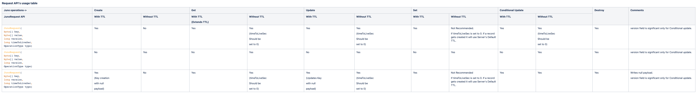

[](https://opensource.org/licenses/Apache-2.0)

# Juno Java SDK
Juno Client provides Juno DB operations through both Asynchronous and Synchronous APIs. The Asynchronous API's are implemented using RxJava and Reactor. The JunoAsyncClient class provides the RxJava API's whereas the JunoReactClient class provides the Reactor API's.

## Features
Operations Supported

| Operation Name | Description                                                                                                                                                                                                                                                                                     |
|----------------|-------------------------------------------------------------------------------------------------------------------------------------------------------------------------------------------------------------------------------------------------------------------------------------------------|
| Create         | Inserts a key-value pair record into DB                                                                                                                                                                                                                                                         |
| Get            | Retrieves an record that is stored in the DB                                                                                                                                                                                                                                                    |
| Update         | Updates an existing record with the new value                                                                                                                                                                                                                                                   |
| Set            | Will update the record if found in DB else inserts the record into DB                                                                                                                                                                                                                           |
| Delete         | Deletes a record from DB                                                                                                                                                                                                                                                                        |
| CompareAndSet  | Compares the version of the current record in the DB with the supplied version, the record will be updated only if the supplied version matches the version in DB. CompareAndSet has to be always proceeded by a GET operation. And should only use the record context from the GET's response. |
| DoBatch        | Will process a batch of requests. A list of requests has to be supplied for this API and will receive a list of responses corresponding to the requests                                                                                                                                         |
| getProperties  | Returns a Map of configured Juno properties                                                                                                                                                                                                                                                     |


Frequently used fields and its definitions

| Fields        | Definition                                                                                                                      |
|---------------|---------------------------------------------------------------------------------------------------------------------------------|
| Key           | 	Record key. Juno always needs a key for any read/write operation                                                               |
| Value/payload | Record value. It can be empty                                                                                                   |
| TTL           | 	Time to live. This field represents the life time of a record. After the TTL expires the record gets purged from Juno          |
| Version       | 	Record version. When a record gets created its version will be 1 and it gets incremented by 1 after each update/set operations |

All the above operations are supported in Sync and Async formats. For Async format the DoBatch alone returns observable and rest of the operations return Single.

## Quick Start

    <dependency>
        <groupId>com.paypal.juno</groupId>
        <artifactId>juno-client-api</artifactId>
        <version>Juno client version</version>
    </dependency>
    <dependency>
        <groupId>com.paypal.juno</groupId>
        <artifactId>juno-client-impl</artifactId>
        <version>Juno client version</version>
    </dependency>


## Configuration
The following are the Juno Client properties that application has to supply to create the Juno Client object.

Mandatory Parameters

    juno.application_name=JunoTest              //Name of the Application using this library
    juno.record_namespace=JunoNS                //Record namespace where the record is to be stored
    juno.server.host=${junoserv_host}           //Host name/ VIP of Juno Server.
    juno.server.port=${junoserv_port}           //Connection port of Juno Server

Optional Parameters

    juno.default_record_lifetime_sec=1800       //Specify default lifetime for the operations - Default is 259200 sec. This TTL will be applicable when using API without TTL parameter.
    juno.max_record_lifetime_sec=1296000        //Specify max TTL for the records. This MAX value gets applied for validation for Juno API's with or without TTL.
    juno.connection.timeout_msec=100            //Client connection timeout to the Juno server - Default is 1000 msec (its 200ms from version 2.2.0).
    juno.connection.max_timeout_msec=2000       //This a cap on the connection.timeout_msec,so that connection.timeout_msec does not exceed this value, default is 1000. Deprecated from 2.2.0.
    juno.response.timeout_msec=200              //Response timeout in milli sec - Default is 1000 msec  (its 200ms from version 2.2.0).
    juno.response.max_timeout_msec=2000         //This a cap on the response.timeout_msec so that response.timeout_msec cannot exceed this value, default is 1000 msec. Deprecated from 2.2.0
    juno.usePayloadCompression=true             //To compress the payload before sending to Juno server.Default is false. Default max payload size supported is 200KB.
    juno.operation.retry=true                   //To retry a failed operation once for non-batch API's.Default is false.

### Base Configuration

_(Path - src/main/resources/META-INF/configuration/Common/config/application.properties)_

## Instantiating the JunoClient using JunoClientFactory
Example of JunoClient without SSLContext
```
URL url = this.getClass().getResource("/path/to/juno.properties");
Properties pConfig = new Properties();
pConfig.load(url.openStream());
junoClient = JunoClientFactory.newJunoClient(new JunoPropertiesProvider(pConfig));
```

Example of JunoClient with SSLContext after reading ca.crt secrets and creating a TrustManager
```
String userDirectory = System.getProperty("user.dir");
File file = new File(userDirectory + "/path/to/application/secrets/ca.crt");
InputStream in = new FileInputStream(file);

String ca_cert = IOUtils.toString(in, StandardCharsets.UTF_8);
CertificateFactory cf = CertificateFactory.getInstance("X.509");
Certificate cert1 = cf.generateCertificate(new ByteArrayInputStream(ca_cert.getBytes()));

KeyStore keyStore = KeyStore.getInstance(KeyStore.getDefaultType());
keyStore.load(null);
keyStore.setCertificateEntry("alias", cert1);

TrustManagerFactory tmf = TrustManagerFactory.getInstance("X509");
tmf.init(keyStore);
TrustManager[] trustManagers = tmf.getTrustManagers();

SSLContext sslContext = SSLContext.getInstance("TLS");
sslContext.init(null, trustManagers, null);

URL url = this.getClass().getResource("/path/to/juno.properties");
Properties pConfig = new Properties();
pConfig.load(url.openStream());
junoClient = JunoClientFactory.newJunoClient(new JunoPropertiesProvider(pConfig), sslContext);
```

## Sample Code for Sync API
The following code snippet shows how to use the Juno synchronous API's. It connects to the Juno Server, stores a Document, retrieves , updates and deletes it .

The time-to-live (TTL) is the lifetime of the data record and that TTL value is provided as a number of seconds.

<details>
  <summary>Create operation with TTL</summary>

```java
try{
    JunoResponse response = client.create("Test1".getBytes(),"Value1".getBytes(),5); //5 is user supplied TTL
    if(response.getStatus() == OperationStatus.Success){
        // Successfully inserted the key Test1.
    }
    else{
        // Failed inserting key Test1
        // The cause for failure can be obtained via response.getStatus().getErrorText()
    }
}catch(JunoException e){
    //Handle exception based on the type of the Operation.

}
```
</details>

<details>
  <summary>Get operation</summary>

```java
try{
    JunoResponse response = client.get("Test1".getBytes());

    if(response.getStatus() == OperationStatus.Success){
        // Successfully read the key Test1.
    }else if(response.getStatus() == OperationStatus.NoKey){
        // Either the key is not present in the DB or it has expired.
    }else{
        // Failed Read key Test1
        // The cause for failure can be obtained via response.getStatus().getErrorText()
    }
}catch(JunoException e){
    //Handle exception based on the type of the Operation.
}
```
</details>

<details>
  <summary>Get operation (with TTL)</summary>

```java
try{
    JunoResponse response = client.get("Test1".getBytes(), 100); // It will try and to extend the TTL of the record to (now+100) Sec if the 100 is greater than remaining TTL of the record.

    if(response.getStatus() == OperationStatus.Success){
        // Successfully read the key Test1.
    }else if(response.getStatus() == OperationStatus.NoKey){
        // Either the key is not present in the DB or it has expired.
    }else if(response.getStatus() == OperationStatus.TTLExtendFailure){
        // Failure to Extend the TTL of the record.
    }else{
        // Failed Read key Test1
        // The cause for failure can be obtained via response.getStatus().getErrorText()
    }
}catch(JunoException e){
    //Handle exception based on the type of the Operation.

}
```
</details>
<details>
  <summary>Update operation</summary>

```java
try{
    JunoResponse response = client.update("Test1".getBytes(),"Value2".getBytes());

    if(response.getStatus() == OperationStatus.Success){
        // Successfully updated the key Test1.
    }else if(response.getStatus() == OperationStatus.NoKey){
        // Either the key is not present in the DB or it has expired.
    }else if(response.getStatus() == OperationStatus.RecordLocked){
        // The record is currently locked for update from another client.
    }else{
        // Failed Read key Test1
        // The cause for failure can be obtained via response.getStatus().getErrorText()
    }
}catch(JunoException e){
    //Handle exception based on the type of the Operation.

    }
```
</details>
<details>
  <summary>Update operation with TTL</summary>

```java
try{
    JunoResponse response = client.update("Test1".getBytes(),"Value2".getBytes(),5); //5 is user supplied TTL

    if(response.getStatus() == OperationStatus.Success){
        // Successfully updated the key Test1.
    }else if(response.getStatus() == OperationStatus.NoKey){
        // Either the key is not present in the DB or it has expired.
    }else if(response.getStatus() == OperationStatus.RecordLocked){
        // The record is currently locked for update from another client.
    }else{
        // Failed Read key Test1
        // The cause for failure can be obtained via response.getStatus().getErrorText()
    }
}catch(JunoException e){
    //Handle exception based on the type of the Operation.

    }
```
</details>
<details>
  <summary>Set operation (updates the record if present else creates it)</summary>

```java
try{
    JunoResponse response = client.set("Test1".getBytes(),"Value3".getBytes()); //It will use the configured TTL (default config is 259200)

    if(response.getStatus() == OperationStatus.Success){
        // Successfully updated/created the key Test1.
    }else if(response.getStatus() == OperationStatus.RecordLocked){
        // The record is currently locked for update from another client.
    }else{
        // Failed update/create key Test1
        // The cause for failure can be obtained via response.getStatus().getErrorText()
    }
}catch(JunoException e){
    //Handle exception based on the type of the Operation.

}
```
</details>
<details>
  <summary>Set operation with TTL (updates the record if present else creates it)</summary>

```java
try{
    JunoResponse response = client.set("Test1".getBytes(),"Value3".getBytes(),5); //5 is user supplied TTL

    if(response.getStatus() == OperationStatus.Success){
        // Successfully updated/created the key Test1.
    }else if(response.getStatus() == OperationStatus.RecordLocked){
        // The record is currently locked for update from another client.
    }else{
        // Failed update/create key Test1
        // The cause for failure can be obtained via response.getStatus().getErrorText()
    }
}catch(JunoException e){
    //Handle exception based on the type of the Operation.

    }
```
</details>
<details>
  <summary>CompareAndSet operation</summary>

```java

try{
    JunoResponse response = client.get("Test1".getBytes());

    if(response.getStatus() == OperationStatus.Success){
        response = client.compareAndSet(response.getRecordContext(),"Value2".getBytes(),0);
    
        // The record gets updated only if its version does not change between the get and compareAndSet
        // calls (i.e no updates to the record between the two calls).
    
        if(response.getStatus() == OperationStatus.Success){
            // Successfully the key Test1 got updated.
        }else{
            // Failed to update key Test1
            if(response.getStatus() == OperationStatus.NoKey){
                //Key not in DB. Some one might have deleted the record.
            }else if(response.getStatus() == OperationStatus.ConditionViolation){
                // Some one might have updated the record before we did.
            }else if(response.getStatus() == OperationStatus.RecordLocked){
                // Some other request has locked the record for update.
            }else {
                // Log response.getStatus().getErrorText()
            }
        }
    }else{
        // Failed get key Test1
        if(response.getStatus() == OperationStatus.NoKey){
        //Key not in DB
        }else {
        // Log response.getStatus().getErrorText()
        }
    }
}catch(JunoException e){
        //Handle exception based on the type of the Operation.
    }
```
</details>
<details>
  <summary>CompareAndSet operation with TTL</summary>

```java
try{
    JunoResponse response = client.get("Test1".getBytes(), 5); //5 is user supplied TTL

    if(response.getStatus() == OperationStatus.Success){
        response = client.compareAndSet(response.getRecordContext(),"Value2".getBytes(),0);

        // The record gets updated only if its version does not change between the get and compareAndSet
        // calls (i.e no updates to the record between the two calls).

        if(response.getStatus() == OperationStatus.Success){
            // Successfully the key Test1 got updated.
        }else{
            // Failed to update key Test1
            if(response.getStatus() == OperationStatus.NoKey){
                //Key not in DB. Some one might have deleted the record.
            }else if(response.getStatus() == OperationStatus.ConditionViolation){
                // Some one might have updated the record before we did.
            }else if(response.getStatus() == OperationStatus.RecordLocked){
                // Some other request has locked the record for update.
            }else {
                // Log response.getStatus().getErrorText()
            }
        }
    }else{
        // Failed get key Test1
        if(response.getStatus() == OperationStatus.NoKey){
            //Key not in DB
        }else {
            // Log response.getStatus().getErrorText()
        }
    }
}catch(JunoException e){
    //Handle exception based on the type of the Operation.
}
```
</details>
<details>
  <summary>Delete operation</summary>

```java
try{
    JunoResponse response = client.delete("Test1".getBytes());

    if(response.getStatus() == OperationStatus.Success){
        // Successfully deleted the key Test1. This will be success even if the key is not present in Juno DB.
    }else{
        // Failed delete the key
        // The cause for failure can be obtained via response.getStatus().getErrorText()
    }
}catch(JunoException e){
    //Handle exception based on the type of the Operation.

}
```
</details>
<details>
  <summary>doBatch operation (sync) - doBatch API takes a list of JunoRequest object. Each object is an individual operation. The Response is Iterable list of JunoResponses for each individual operation.</summary>

```java
try{
    List<JunoRequest> jReqList = new ArrayList<JunoRequest>();
    jReqList.add(new JunoRequest("Test1".getBytes(),"Value1".getBytes(),0,5,JunoRequest.OperationType.Create));
    jReqList.add(new JunoRequest("Test2".getBytes(),"Value2".getBytes(),0,5,JunoRequest.OperationType.Set));
    jReqList.add(new JunoRequest("Test3".getBytes(),"".getBytes(),0,5,JunoRequest.OperationType.Destroy));
    Iterable<JunoResponse> jResp = client.doBatch(jReqList);

    for(JunoResponse resp: jResp) {
        if(resp.getStatus() == OperationStatus.Success){
            // Operation Successful
        }else{
            // Operation failed
            // The cause for failure can be obtained via resp.getStatus().getErrorText()
        }
    }
}catch(JunoException e){
    //Handle exception based on the type of the Operation.

    }
```
</details>
<details>
  <summary>getProperties operation (sync & Async) - Used to fetch the current property of Juno client bean. The following are the properties that that can be fetched from the Juno client bean.</summary>

```java
Map<String, String> junoProperties = junoClient.getProperties();

//To fetch a particular property use the below statement
String host = junoProperties.get(JunoProperties.HOST);
String port = junoProperties.get(JunoProperties.PORT);
String connPoolSize = junoProperties.get(JunoProperties.CONNECTION_POOL_SIZE);
String ns = junoProperties.get(JunoProperties.RECORD_NAMESPACE);
String lt = junoProperties.get(JunoProperties.DEFAULT_LIFETIME);
String retry = junoProperties.get(JunoProperties.ENABLE_RETRY);
String responseTimeout = junoProperties.get(JunoProperties.RESPONSE_TIMEOUT);
String connectionTimeout = junoProperties.get(JunoProperties.CONNECTION_TIMEOUT);
String appName = junoProperties.get(JunoProperties.APP_NAME);
String appName = junoProperties.get(JunoProperties.USE_PAYLOADCOMPRESSION);
String appName = junoProperties.get(JunoProperties.BYPASS_LTM);
String prefix = junoProperties.get(JunoProperties.CONFIG_PREFIX); // Prefix that is added to the Juno properties. expl- session.juno.default_record_lifetime_sec=2400 - prefix is session
```
</details>

#### See the Common errors section for additional operation status values to handle for non-Success responses.


## Sample Code for Single operation Async API
A single subscriber has to be defined to handle the response of all async single operation API calls. The single subscriber has only two methods one is for success of the operation and other is for the Error scenario. The User has to handle both the scenarios here. Both these methods should not block for any reason.

## Create operation (RxJava - Single)
<details>
  <summary>Subscriber for Create operation</summary>

```java
SingleSubscriber<JunoResponse> createSubscriber = new SingleSubscriber<JunoResponse>() {
    @Override
    public void onError(Throwable e) {
        // Failure in processing the request. Do not SLEEP or BLOCK in this method.
        // The cause for failure can be obtained via e.getMessage()
    }
    
    @Override
    public void onSuccess(JunoResponse res) {
        // Successfully processed the record. Do not SLEEP or BLOCK in this method.
        if(res.getStatus() == OperationStatus.Success){
            // Successfully created the key in DB
        } else {
            if(res.getStatus() == OperationStatus.UniqueKeyViolation){
                // Key Already exists in DB
            } else{
            // Log response.getStatus().getErrorText()
            }
        }
    }
};
```
</details>
<details>
  <summary>Create operation with TTL</summary>

```java
try{
    Single<JunoResponse> response = client.create("Test1".getBytes(),"Value1".getBytes(),5); //5 is user supplied TTL
    response.subscribe(createSubscriber);
}catch(Exception e){
    // Exception while creating the single or during subscription.
}
```
</details>
<details>
  <summary>Create operation without TTL</summary>

```java
try{
    Single<JunoResponse> response = client.insert("Test1".getBytes(),"Value1".getBytes()); //It will use the configured TTL i.e 259200
    response.subscribe(createSubscriber);
}catch(Exception e){
    // Exception while creating the single or during subscription.
}
```
</details>

## Create operation (Reactor - Mono)
<details>
  <summary>Create operation with TTL</summary>

```java
try{
    Mono<JunoResponse> monoRes = junoReactClient.create("Test1".getBytes(),"Value1".getBytes(),5); //5 is user supplied TTL and , can be null.

    monoRes.subscribe(res ->
        {
            if(res.getStatus() == OperationStatus.Success){
                // Successfully created the key in DB
            } else {
                if(res.getStatus() == OperationStatus.UniqueKeyViolation){
                    // Key Already exists in DB
                } else{
                    // Log response.getStatus().getErrorText()
                }
            }
        }, error ->
        {
            // Failure in processing the request. Do not SLEEP or BLOCK in this method.
            // The cause for failure can be obtained via error.getMessage()
        );
}catch(Exception e){
    // Exception while subscription.
}
```
</details>
<details>
  <summary>Create operation without TTL</summary>

```java
try{
    Mono<JunoResponse> monoRes = junoReactClient.create("Test1".getBytes(),"Value1".getBytes()); //It will use the configured TTL i.e 259200

    monoRes.subscribe(res ->
        {
            if(res.getStatus() == OperationStatus.Success){
                // Successfully created the key in DB
            } else {
                if(res.getStatus() == OperationStatus.UniqueKeyViolation){
                    // Key Already exists in DB
                } else{
                    // Log response.getStatus().getErrorText()
                }
            }
        }, error ->
        {
            // Failure in processing the request. Do not SLEEP or BLOCK in this method.
            // The cause for failure can be obtained via error.getMessage()
        );
}catch(Exception e){
    // Exception while subscription.
}
```
</details>

## GET operation (RxJava - Single)
<details>
  <summary>Subscriber for Get operation</summary>

```java
SingleSubscriber<JunoResponse> getSubscriber = new SingleSubscriber<JunoResponse>() {
    @Override
    public void onError(Throwable e) {
        // Failure in processing the request. Do not SLEEP or BLOCK in this method.
        // The cause for failure can be obtained via e.getMessage()
    }
    
    @Override
    public void onSuccess(JunoResponse res) {
        // Successfully processed the record. Do not SLEEP or BLOCK in this method.
        if(res.getStatus() == OperationStatus.Success){
            // Successfully retrieved the key from DB
        } else {
            if(res.getStatus() == OperationStatus.Nokey){
                // Key does not exists in DB
            }else if(response.getStatus() == OperationStatus.TTLExtendFailure){ // This error can happen only for get API with TTL
                // Failure to Extend the TTL of the record.
            }else{
                // Log response.getStatus().getErrorText()
            }
        }
    }
};
```
</details>
<details>
  <summary> Get operation with TTL</summary>

```java
try{
    Single<JunoResponse> response = client.get("Test1".getBytes(),5); // 5 is user supplied TTL and It extends the record TTL to (now+5)sec if
    // remaining TTL for the record is < 5 sec.
    response.subscribe(getSubscriber);
}catch(Exception e){
    // Exception while reading the single or during subscription.
}
```
</details>

<details>
  <summary> Get operation without TTL</summary>

```java
try{
    Single<JunoResponse> response = client.get("Test1".getBytes(),"Value1".getBytes()); //It will use the configured TTL i.e 259200
    response.subscribe(getSubscriber);
}catch(Exception e){
    // Exception while reading the single or during subscription.
}
```
</details>

## GET operation (Reactor - Mono)
<details>
  <summary>Get operation with TTL</summary>

```java
try{
    Mono<JunoResponse> monoRes = junoReactClient.get("Test1".getBytes(),5); // 5 is user supplied TTL and It extends the record TTL to (now+5)sec if
    // remaining TTL for the record is < 5 sec.
    monoRes.subscribe(res ->
        {
            if(res.getStatus() == OperationStatus.Success){
                // Successfully retrieved the key from DB
            } else {
                if(res.getStatus() == OperationStatus.Nokey){
                    // Key does not exists in DB
                }else if(response.getStatus() == OperationStatus.TTLExtendFailure){ // This error can happen only for get API with TTL
                    // Failure to Extend the TTL of the record.
                 }else{
                    // Log response.getStatus().getErrorText()
                }
            }
        }, error ->
        {
            // Failure in processing the request. Do not SLEEP or BLOCK in this method.
            // The cause for failure can be obtained via error.getMessage()
        );
}catch(Exception e){
    // Exception while subscription.
}
```
</details>
<details>
  <summary>Get operation without TTL</summary>

```java
try{
    Mono<JunoResponse> monoRes = junoReactClient.get("Test1".getBytes(),"Value1".getBytes()); //It will use the configured TTL i.e 259200
        monoRes.subscribe(res ->
        {
            if(res.getStatus() == OperationStatus.Success){
                // Successfully retrieved the key from DB
            } else {
                if(res.getStatus() == OperationStatus.Nokey){
                    // Key does not exists in DB
                }else if(response.getStatus() == OperationStatus.TTLExtendFailure){ // This error can happen only for get API with TTL
                    // Failure to Extend the TTL of the record.
                }else{
                    // Log response.getStatus().getErrorText()
                }
            }
        }, error ->
        {
            // Failure in processing the request. Do not SLEEP or BLOCK in this method.
            // The cause for failure can be obtained via error.getMessage()
        );
}catch(Exception e){
    // Exception while subscription.
}
```
</details>


Use the try-catch syntax as above for all the following operations and add exception handlers based up on the operation type (refer to the Sync API exception handling) in the Subscriber

```java
RxJava - Single
===============
Update operation with TTL
Single<JunoResponse> response = client.update("Test1".getBytes(),"Value1".getBytes,5); //5 is user supplied TTL.
Update operation without TTL
Single<JunoResponse> response = client.update("Test1".getBytes(),"Value1".getBytes); //It will not update the TTL
Set operation with TTL
Single<JunoResponse> response = client.set("Test1".getBytes(),"Value1".getBytes,5); //5 is user supplied TTL 
Set operation without TTL. .
Single<JunoResponse> response = client.set("Test1".getBytes(),"Value1".getBytes); //It will use the configured TTL i.e 259200
CompareAndSet operation with TTL
Single<JunoResponse> response = client.compareAndSet(recCtx,"Value1".getBytes,5,null); //5 is user supplied TTL 
Delete.
Single<JunoResponse> response = client.delete("Test1".getBytes());

Reactor - Mono
==============
Update operation with TTL
Mono<JunoResponse> response = junoReactClient.update("Test1".getBytes(),"Value1".getBytes,5); //5 is user supplied TTL. . 
Update operation without TTL
Mono<JunoResponse> response = junoReactClient.update("Test1".getBytes(),"Value1".getBytes); //It will not update the TTL
Set operation with TTL
Mono<JunoResponse> response = junoReactClient.set("Test1".getBytes(),"Value1".getBytes,5); //5 is user supplied TTL 
Set operation without TTL. .
Mono<JunoResponse> response = junoReactClient.set("Test1".getBytes(),"Value1".getBytes); //It will use the configured TTL i.e 259200
CompareAndSet operation with TTL
Mono<JunoResponse> response = junoReactClient.compareAndSet(recCtx,"Value1".getBytes,5,null); //5 is user supplied TTL 
Delete.
Mono<JunoResponse> response = junoReactClient.delete("Test1".getBytes());
```


## Sample Code for Batch Async API
For doBatch, Subscriber has to be defined for processing the requests. The subscriber has three methods, one for completion of individual operation i.e onNext, one for total completion of the batch i.e onComplete and last one is for the Error scenario. For Reactor Subscriber there is one more method to be overridden i.e onSubscribe where the subscriber can specify how many responses that they need. The User has to handle all the scenarios here. And none of the methods should not block for any reason.

### (RxJava - Observable)
<details>
  <summary>RxJava Subscriber for Batch operation</summary>

```java
Subscriber<JunoResponse> batchSubscriber = new Subscriber<JunoResponse>() {
    @Override
    public void onCompleted() {
        // Batch processing completed.
    }
    @Override
    public void onError(Throwable e) {
        // Failure in processing the request. Do not SLEEP or BLOCK in this method.
        // The cause for failure can be obtained via e.getMessage()
    }
    @Override
    public void onNext(JunoResponse res) {
        // Successfully processed the record. Do not SLEEP or BLOCK in this method.
        if(res.getStatus() == OperationStatus.Success){
            // Key Created Successfully.
        }else if(res.getStatus() == OperationStatus.UniqueKeyViolation){
            // Key Already exists in DB
        }else if(res.getStatus() == OperationStatus.RecordLocked){
            // The record is locked by another request
        }
    }
};
```
</details>

<details>
  <summary>RxJava doBatch Example</summary>

```java
try{
    List<JunoRequest> jReqList = new ArrayList<JunoRequest>();
    jReqList.add(new JunoRequest("Test1".getBytes(),"Value1".getBytes(),0,5,JunoRequest.OperationType.Create)); // Pass TTL explicitly to override default TTL
    jReqList.add(new JunoRequest("Test2".getBytes(),"Value2".getBytes(),0,JunoRequest.OperationType.Create)); // To use the configured default TTL
    jReqList.add(new JunoRequest("Test3".getBytes(),"Value3".getBytes(),0,5,JunoRequest.OperationType.Set)); // Pass TTL explicitly to override default TTL
    jReqList.add(new JunoRequest("Test4".getBytes(),0,0,JunoRequest.OperationType.Destroy)); // TTL and Version will be ignored so set to 0
    jReqList.add(new JunoRequest("Test5".getBytes(),0,0,JunoRequest.OperationType.Get)); // Set 0 for TTL if you do not wish to extend the TTL of the record on Get
    jReqList.add(new JunoRequest("Test6".getBytes(),0,JunoRequest.OperationType.Get)); // Use the API that does not have TTL. Let version be set to 0
    jReqList.add(new JunoRequest("Test7".getBytes(),"Value7".getBytes(),2,5,JunoRequest.OperationType.Update)); // Will update this key only if the current version in Juno is 2.
    Observable<JunoResponse> response = client.doBatch(jReqList); 
    response.subscribe(batchSubscriber);
}catch(Exception e){
    // Exception while creating the Observable or during subscription
}
```
</details>

### (Reactor - Flux)
<details>
  <summary>React Subscriber for Batch operation</summary>

```java
Subscriber<JunoResponse> batchReactSubscriber = new Subscriber<JunoResponse>() {
    @Override
    public void onSubscribe(Subscription s) {
        s.request(Long.MAX_VALUE); // This specifies how many responses the subscriber is expecting or needed. Set this to Long.MAX_VALUE as subscriber expects all the Juno responses.
    }
    @Override
    public void onCompleted() {
        // Batch processing completed.
    }
    @Override
    public void onError(Throwable e) {
        // Failure in processing the request. Do not SLEEP or BLOCK in this method.
        // The cause for failure can be obtained via e.getMessage()
    }
    @Override
    public void onNext(JunoResponse res) {
        // Successfully processed the record. Do not SLEEP or BLOCK in this method.
        if(res.getStatus() == OperationStatus.Success){
            // Key Created Successfully.
        }else if(res.getStatus() == OperationStatus.UniqueKeyViolation){
            // Key Already exists in DB
        }else if(res.getStatus() == OperationStatus.RecordLocked){
            // The record is locked by another request
        }
    }
};
```
</details>

<details>
  <summary>RxJava doBatch Example</summary>

```java

try{
    List<JunoRequest> jReqList = new ArrayList<JunoRequest>();
    jReqList.add(new JunoRequest("Test1".getBytes(),"Value1".getBytes(),0,5,JunoRequest.OperationType.Create)); // Pass TTL explicitly to override default TTL
    jReqList.add(new JunoRequest("Test2".getBytes(),"Value2".getBytes(),0,JunoRequest.OperationType.Create)); // To use the configured default TTL
    jReqList.add(new JunoRequest("Test3".getBytes(),"Value3".getBytes(),0,5,JunoRequest.OperationType.Set)); // Pass TTL explicitly to override default TTL
    jReqList.add(new JunoRequest("Test4".getBytes(),0,0,JunoRequest.OperationType.Destroy)); // TTL and Version will be ignored so set to 0
    jReqList.add(new JunoRequest("Test5".getBytes(),0,0,JunoRequest.OperationType.Get)); // Set 0 for TTL if you do not wish to extend the TTL of the record on Get
    jReqList.add(new JunoRequest("Test6".getBytes(),0,JunoRequest.OperationType.Get)); // Use the API that does not have TTL. Let version be set to 0
    jReqList.add(new JunoRequest("Test7".getBytes(),"Value7".getBytes(),2,5,JunoRequest.OperationType.Update)); // Will update this key only if the current version in Juno is 2.
    Flux<JunoResponse> response = junoReactClient.doBatch(jReqList);
    response.subscribe(batchReactSubscriber);
}catch(Exception e){
    // Exception while creating the Observable or during subscription
}
```
</details>

## Request API's usage table


## Common errors
The following are the commonly encountered error's while invoking the API. Juno client will re-try the below errors that are marked as [Can Retry] if retry is enabled with "juno.operation.retry=true".
```
NoKey              - Trying to perform an operation in a key that does not exist in the DB
UniqueKeyViolation - Trying to create a record with the key which already exists in the DB
RecordLocked       - [Can Retry] Trying to perform an operation on record that is already locked by another request
ConditionViolation - Trying to perform compareAndSet on a record with a old requestContext. i.e the record has been updated by some other request, bumping its version to a higher value than the one in this current request.
TTLExtendFailure   - [Can Retry] Unable to extend TTL for a get operation. Likely the record is locked by some other request.
```
The following are the common exception's while invoking the API.
```
NoStorage       - [Can Retry] This error happens when the Juno proxy is unable to communicate with the storage sever. 
IllegalArgument - Error in supplied arguments 
ResponseTimeout - Response from server timed out
InternalError   - [Can Retry] Error caused by either Juno server or client while processing.
```

A complete list of operation status values that can be returned is available in the OperationStatus.java file.

## Record Context
The RecordContext class defined in the RecordContext.java file provides meta data about an individual data record.  It can be obtained by making a getRecordContext() call on the JunoResponse returned from a successful Juno API operation.  Make sure to check the OperationStatus to determine if a valid data record was found to populate the record context before using the record context.  The record context can be used to access information such as the record's version, creation time and TTL.

```java
try{
    JunoResponse response = client.get("Test1".getBytes());

    if(response.getStatus() == OperationStatus.Success){
        // Successfully read the key Test1.
        RecordContext rctx = response.getRecordContext();
        long rver = rctx.getVersion();
    }
}catch(JunoException e){
    //Handle exception based on the type of the Operation.

}
```

Source Code and Additional SDK Documentation
The source code and SDK documentation for The Juno Java Client can be found at https://github.com/paypal/junoDB/tree/main/client/Java/Juno

Sample Juno client Application
We also have sample Juno java app for reference. Application teams can refer this sample app for any doubts about implementation. Git Link -

To test this App please use postman and following commands,
```
Create Operation:  POST, URL - "https://localhost:8080/samplejuno/recordcreate" ,Body (x-www-form-urlencoded) Fields -(KEY -key, VALUE - record Key), (KEY -value, VALUE - record value)
Get Operation: GET, URL - "https://localhost:8080/samplejuno/reactget/testkey", No Body.
Set Operation: POST, URL - "https://localhost:8080/samplejuno/reactset/", Body (x-www-form-urlencoded) Fields -(KEY -key, VALUE - record Key), (KEY -value, VALUE - record value)
Update Operation: POST, URL - "https://localhost:8080/samplejuno/reactupdate/", Body (x-www-form-urlencoded) Fields -(KEY -key, VALUE - record Key), (KEY -value, VALUE - record value)
Delete operation: DELETE, URL - "https://localhost:8080/samplejuno/reactdelete/testkey", No Body.
```
