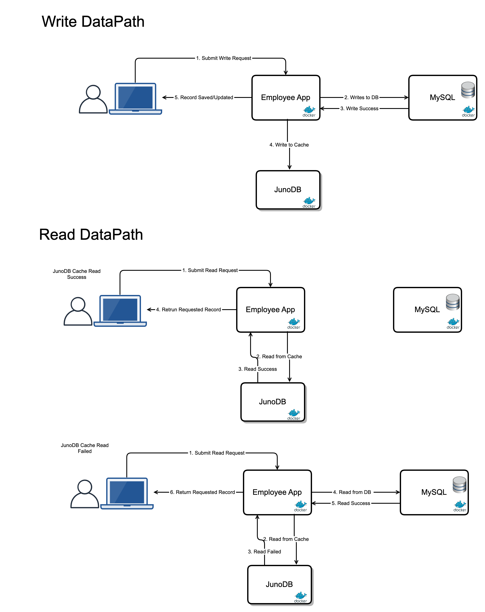

# Employee Dashboard App

## Use Case
To cache employee records for fast Reads



## Tested Using
- Maven version 3.8.1
- Java version 11
- Docker version 20.10.14
- Docker Compose version v2.5.1
```bash
mvn -version
Apache Maven 3.8.1 (05c21c65bdfed0f71a2f2ada8b84da59348c4c5d)
Maven home: /opt/apache-maven-3.8.1
Java version: 11.0.10, vendor: Azul Systems, Inc., runtime: /Library/Java/JavaVirtualMachines/zulu-sa-11.0.10.jdk/Contents/Home
Default locale: en_US, platform encoding: UTF-8
OS name: "mac os x", version: "10.16", arch: "x86_64", family: "mac"

docker version 
Client:
 Cloud integration: v1.0.24
 Version:           20.10.14
 API version:       1.41
 Go version:        go1.16.15
 Git commit:        a224086
 Built:             Thu Mar 24 01:49:20 2022
 OS/Arch:           darwin/amd64
 Context:           default
 Experimental:      true

Server: Docker Desktop 4.8.2 (79419)
 Engine:
  Version:          20.10.14
  API version:      1.41 (minimum version 1.12)
  Go version:       go1.16.15
  Git commit:       87a90dc
  Built:            Thu Mar 24 01:46:14 2022
  OS/Arch:          linux/amd64
  Experimental:     false
 containerd:
  Version:          1.5.11
  GitCommit:        3df54a852345ae127d1fa3092b95168e4a88e2f8
 runc:
  Version:          1.0.3
  GitCommit:        v1.0.3-0-gf46b6ba
 docker-init:
  Version:          0.19.0
  GitCommit:        de40ad0

docker compose version 
Docker Compose version v2.5.1
```

## Build and Run docker images

- Make sure the juno containers are running for the employee dashboard app to connect to juno cache

```bash
cd docker
docker compose up -d


# You can also pass the DOCKER_NETWORK=manifest_junonet which is the network created when the juno docker containers are initialized following the instructions at https://github.com/paypal/junodb#run-junodb 
# here DOCKER_NETWORK env var is setting the network for docker containers to start in same network as juno containers 
DOCKER_NETWORK=manifest_junonet docker compose up -d 

```

### View running docker containers
```bash

#junodb containers should also be running for app to enable caching. Observe running containers.
CONTAINER ID   IMAGE                                                 COMMAND                  CREATED             STATUS                       PORTS                                                                    NAMES
7f06f13450d7   emp                                                   "java -jar /opt/app/…"   37 minutes ago      Up 37 minutes                8080/tcp, 0.0.0.0:8082->8082/tcp                                         emp
6d811fd587b9   adminer:4.8.1                                         "entrypoint.sh php -…"   37 minutes ago      Up 37 minutes                0.0.0.0:8083->8080/tcp                                                   adminer
293872bfd38d   mysql/mysql-server:8.0.32                             "/entrypoint.sh --de…"   37 minutes ago      Up 37 minutes (healthy)      3307/tcp, 33060-33061/tcp, 0.0.0.0:3307->3306/tcp                        mysqldb
da639483604e   registry.hub.docker.com/juno/junoclient:latest        "tail -f /dev/null"      About an hour ago   Up About an hour (healthy)                                                                            junoclient
ac004ce80aae   registry.hub.docker.com/juno/junoserv:latest          "bash /opt/juno/bin/…"   About an hour ago   Up About an hour (healthy)   0.0.0.0:5080->5080/tcp, 0.0.0.0:8080->8080/tcp, 0.0.0.0:8088->8088/tcp   proxy
d76ef3921503   registry.hub.docker.com/juno/junostorageserv:latest   "bash /opt/juno/bin/…"   About an hour ago   Up About an hour (healthy)   0.0.0.0:8089->8089/tcp                                                   storageserv
70e4aad7634c   registry.hub.docker.com/juno/junoclustercfg:latest    "bash /opt/juno/entr…"   About an hour ago   Up About an hour (healthy)                                                                            clustercfg
7ddfe2538570   registry.hub.docker.com/juno/junoclusterserv:latest   "bash /opt/juno/entr…"   About an hour ago   Up About an hour (healthy)   2379/tcp                                                                 etcd
```


employee app `emp` is listening on 0.0.0.0:8082
```bash
curl 0.0.0.0:8082
```


<<<<<<< HEAD
## To Build and Run locally
=======
## To Build Locally

## Jdk 11 install
```bash
sudo add-apt-repository ppa:openjdk-r/ppa
sudo apt-get update
sudo apt install openjdk-11-jdk
```

## To Build jar
```bash
First install mvn
sudo apt update
sudo apt install default-jdk
sudo apt install maven
mvn clean package -DskipTests=true
```

## Dependencies
>>>>>>> 63b47ee (Employee dashboard app update)

- Make sure mysql is up

- Check the property `spring.datasource.url` in 'target/classes/application.properties' to be pointing to the correct mysql server
- To update , make the change in `src/main/resources/application.properties` and build again

## To run jar
```bash
java -jar target/*.jar
```
