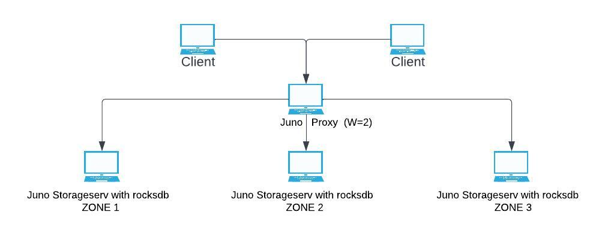
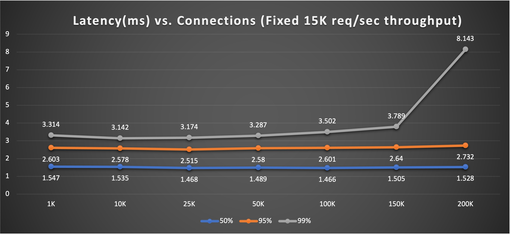
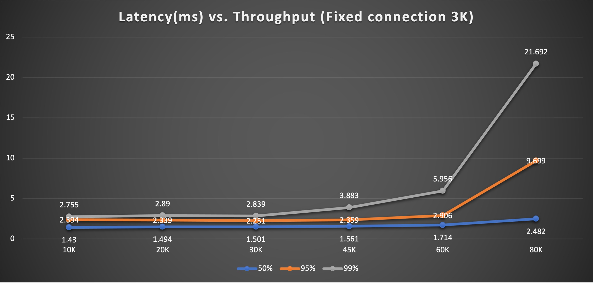
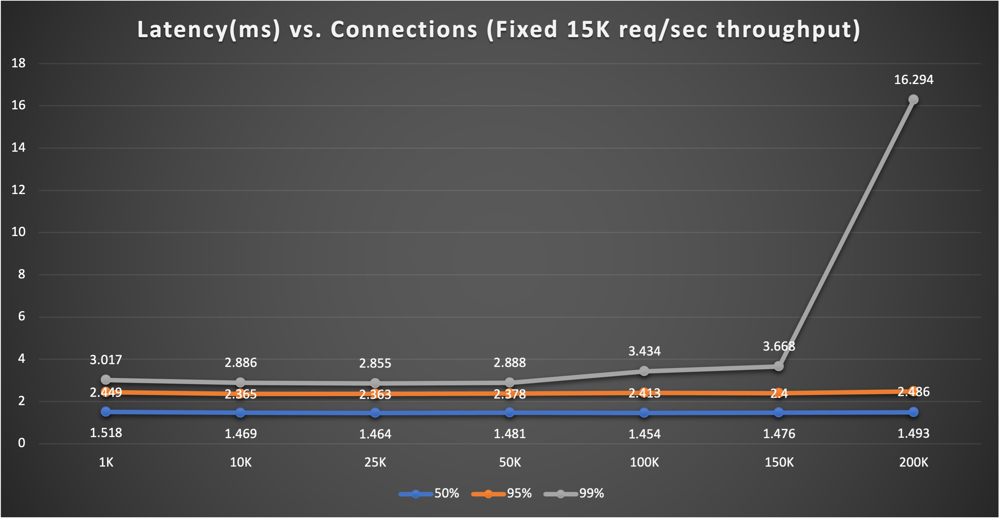
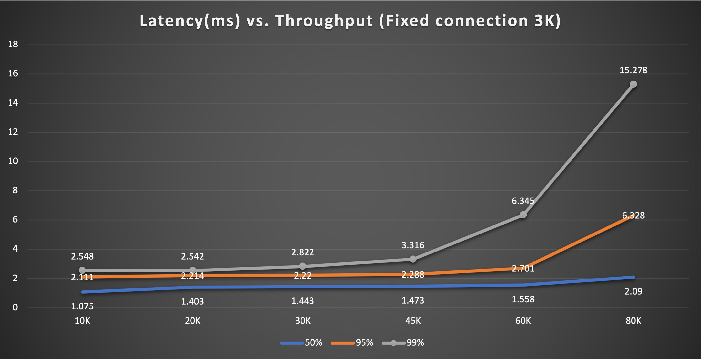

[](https://opensource.org/licenses/Apache-2.0)
# Juno Performance Benchmark
This performance benchmark measures the number of connections and throughput juno supports. Test set up shows below. It contains multiple clients, one proxy, three storageserv (W=2) quorum read/write with rocksdb.

## Test Setup 

One juno proxy(8 workers), three juno storageserv(12 workers each) with W=2 read/write. Ten clients for fixed throughput
non-fixed connection test. Two clients for fixed connections non-fixed throughput test. Below graph shows set up
<details>
  <summary>Juno Performance Test Set Up Graph</summary>



</details>

Idle time set as 65 minutes on juno proxy, recycle time set as one hour on client side so the connection can be
kept established during one hour run even the connection is idle. We did four tests total. Two tests with rocksdb size
less than 1G after one hour so the rocksdb compaction is minimum. Two tests with rocksdb size 28G after one hour run so it performs more db compactions then previous tests

#### Machine Details:
* All the boxes are n1-highmem-32 32 CPUs with Intel(R) Xeon(R) CPU @ 2.30GHz, 16 cores per socket. 
* Operation System GNU/Linux (Ubuntu 16.04 xenial)
* Machine memory: 214G of RAM
* Rocksdb disk size: 450G Balanced SSD

### Test1: Max 200K connections one juno proxy supports, minimum compaction
#### One proxy, client side response time vs. different connections



Fixed 15K requests/sec (2K payload) to one proxy, request ratio is C:1,S:1,G:1,U:1,D:1(C-Create,S-Set,G-Get,U-Update,D-Destroy). 
Ten clients drive connections from 1K to 200K, minimum data compaction on rocksdb (rocksdb size less than 1G after one hour run)

Notes: During the initial connection establishment, it has errors and very long response time. Once all connections are established 
and become stable, the response time returns to normal and error will be gone

<details>
  <summary> Sample test profile run with [junoload tool](junoload.md) run on client box (1 out of 10 clients) </summary>

```bash
./junoload -s <ip:port> -f 300 -n 500 -l 2000 -ssl -t 3600 -c config.toml &> jload1_1 &
sleep 3
./junoload -s <ip:port> -f 300 -n 500 -l 2000 -ssl -t 3600 -c config.toml &> jload1_2 &
sleep 3
./junoload -s <ip:port> -f 300 -n 500 -l 2000 -ssl -t 3600 -c config.toml &> jload1_3 &
sleep 3
./junoload -s <ip:port> -f 300 -n 500 -l 2000 -ssl -t 3600 -c config.toml &> jload1_4 &
sleep 3
./junoload -s <ip:port> -f 300 -n 500 -l 2000 -ssl -t 3600 -c config.toml &> jload1_5 &

-----  cat config.toml -------
ConnRecycleTimeout="10800s"
ConnectTimeout = "2000ms"
ReadTimeout="1s"
RequestTimeout="1s"
WriteTimeout="1s"

[Sec]
  AppName = "junoserv"
  KeyStoreFilePath = "./secrets/keystore.toml"
  CertPemFilePath = "./secrets/server.crt"
  KeyPemFilePath = "./secrets/server.pem"
  CAFilePath = "./secrets/ca.crt"
  ClientAuth = true
```
</details>

### Test2: Max 80K requests/sec throughput one juno proxy supports, minimum compaction
#### One proxy, client side response time vs. different throughput



Fixed 3K connections(2K payload) to one proxy. Two clients drive throughput from 10K reqs/sec to 80K reqs/sec, request 
ratio is C:1,S:1,G:1,U:1,D:1(C-Create,S-Set,G-Get,U-Update,D-Destroy). When throughput reaches 80K/sec, proxy used up 
almost all CPUs. Minimum data compaction on rocksdb (rocksdb size less than 1G after one hour run)

<details>
  <summary> Sample test profile run with [junoload tool](junoload.md) run on client box (1 out of 2 clients) </summary>

```bash
./junoload -s <ip:port> -f 4500 -n 300 -l 2000 -ssl -t 3600 -c config.toml &> jload1_1 &
sleep 3
./junoload -s <ip:port> -f 4500 -n 300 -l 2000 -ssl -t 3600 -c config.toml &> jload1_2 &
sleep 3
./junoload -s <ip:port> -f 4500 -n 300 -l 2000 -ssl -t 3600 -c config.toml &> jload1_3 &
sleep 3
./junoload -s <ip:port> -f 4500 -n 300 -l 2000 -ssl -t 3600 -c config.toml &> jload1_4 &
sleep 3
./junoload -s <ip:port> -f 4500 -n 300 -l 2000 -ssl -t 3600 -c config.toml &> jload1_5 &
```
</details>

### Test3: Max 200K Connections one juno proxy supports, more compactions triggered
#### One proxy, client side response time vs. different connections



Fixed 15K requests/sec (5K payload) to one proxy, request ratio is C:10,G:30,D:5(C-Create,G-Get,D-Destroy).
Ten clients drive connections from 1K to 200K, some data compaction on rocksdb (rocksdb size 28G after one hour run)

<details>
  <summary> Sample test profile run with [junoload tool](junoload.md) run on client box (1 out of 10 clients) </summary>

```bash
./junoload -s <ip:port> -f 300 -n 500 -l 5000 -ssl -ttl 259200 -p C:10,G:30,D:5 -t 3600 -c config.toml &> jload1_1 &
sleep 3
./junoload -s <ip:port> -f 300 -n 500 -l 5000 -ssl -ttl 259200 -p C:10,G:30,D:5 -t 3600 -c config.toml &> jload1_2 &
sleep 3
./junoload -s <ip:port> -f 300 -n 500 -l 5000 -ssl -ttl 259200 -p C:10,G:30,D:5 -t 3600 -c config.toml &> jload1_3 &
sleep 3
./junoload -s <ip:port> -f 300 -n 500 -l 5000 -ssl -ttl 259200 -p C:10,G:30,D:5 -t 3600 -c config.toml &> jload1_4 &
sleep 3
./junoload -s <ip:port> -f 300 -n 500 -l 5000 -ssl -ttl 259200 -p C:10,G:30,D:5 -t 3600 -c config.toml &> jload1_5 &
```
</details>

### Test4: Max 80K Requests/sec throughput one juno proxy supports, more compactions triggered 
#### One proxy, client side response time vs. Different Throughput


Fixed 3K connections(2K or 4.5K payload so rocksdb size can be the similar after run) to one proxy. Two clients drive 
throughput from 10K reqs/sec to 80K reqs/sec. When throughput reaches 80K/sec, proxy used up almost all CPUs. Some data 
compaction on rocksdb (rocksdb size 27G after one hour run)

<details>
  <summary> Sample test profile run with [junoload tool](junoload.md) run on client box (1 out of 2 clients) </summary>

```bash
./junoload -s <ip:port> -f 1000 -n 300 -l 4500 -ssl -ttl 259200 -p C:10,G:30,D:1 -t 3600 -c config.toml &> jload1_1 &
sleep 3
./junoload -s <ip:port> -f 1000 -n 300 -l 4500 -ssl -ttl 259200 -p C:10,G:30,D:1 -t 3600 -c config.toml &> jload1_2 &
sleep 3
./junoload -s <ip:port> -f 1000 -n 300 -l 4500 -ssl -ttl 259200 -p C:10,G:30,D:1 -t 3600 -c config.toml &> jload1_3 &
sleep 3
./junoload -s <ip:port> -f 1000 -n 300 -l 4500 -ssl -ttl 259200 -p C:10,G:30,D:1 -t 3600 -c config.toml &> jload1_4 &
sleep 3
./junoload -s <ip:port> -f 1000 -n 300 -l 4500 -ssl -ttl 259200 -p C:10,G:30,D:1 -t 3600 -c config.toml &> jload1_5 &
```
</details>
