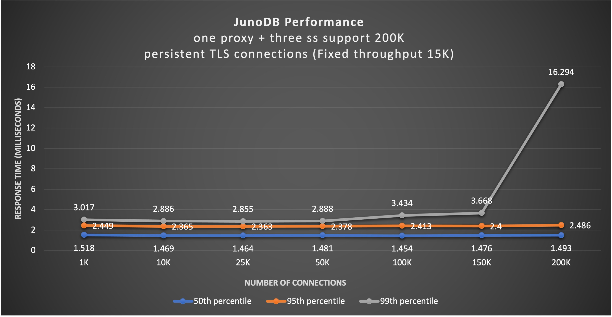
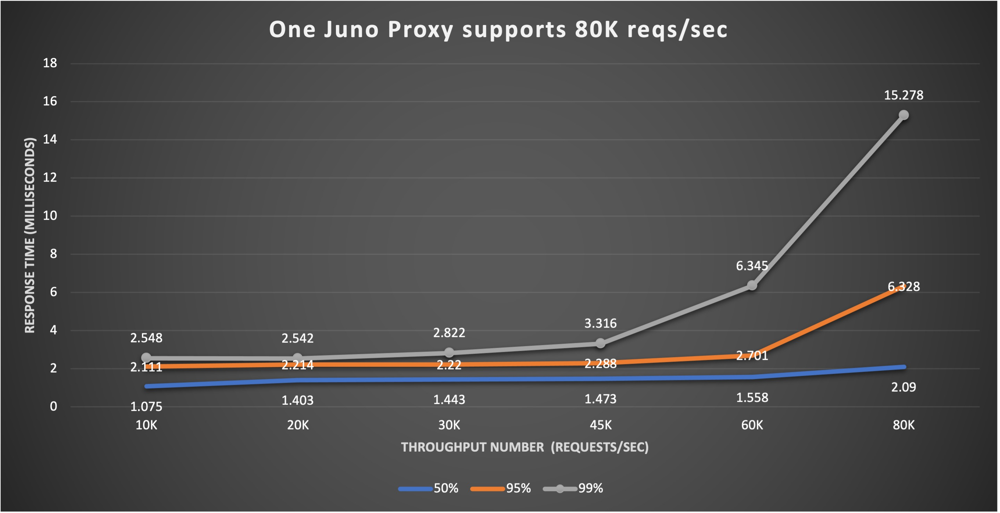

[](https://opensource.org/licenses/Apache-2.0)
# Juno Performance Benchmark
This performance benchmark measures the number of connections and throughput juno supports. 

## Observations
One Juno proxy can support 200TLS connections and 80K requests/sec throughput

### Max 200K TLS connections one juno proxy supports



<details>

  <summary> Sample test profile run on client box (1 out of 10 clients) </summary>

```bash
Fixed 15K requests/sec (5K payload) triggered by [junoload tool](junoload.md) to one proxy. Ten clients drive tls connections from 1K to 200K. During connection establishment, it will consume more CPU and response time could be long or has some errors, but once connection established, the response time will be fast and stable. Rocksdb size 28G after one hour run

./junoload -s <ip:port> -f 300 -n 500 -l 5000 -ssl -ttl 259200 -p C:10,G:30,D:5 -t 3600 -c config.toml &> jload1_1 &
sleep 3
./junoload -s <ip:port> -f 300 -n 500 -l 5000 -ssl -ttl 259200 -p C:10,G:30,D:5 -t 3600 -c config.toml &> jload1_2 &
sleep 3
./junoload -s <ip:port> -f 300 -n 500 -l 5000 -ssl -ttl 259200 -p C:10,G:30,D:5 -t 3600 -c config.toml &> jload1_3 &
sleep 3
./junoload -s <ip:port> -f 300 -n 500 -l 5000 -ssl -ttl 259200 -p C:10,G:30,D:5 -t 3600 -c config.toml &> jload1_4 &
sleep 3
./junoload -s <ip:port> -f 300 -n 500 -l 5000 -ssl -ttl 259200 -p C:10,G:30,D:5 -t 3600 -c config.toml &> jload1_5 &

-----  cat config.toml -------
ConnRecycleTimeout="10800s"
ConnectTimeout = "2000ms"
ReadTimeout="1s"
RequestTimeout="1s"
WriteTimeout="1s"

[Sec]
  AppName = "junoserv"
  KeyStoreFilePath = "./secrets/keystore.toml"
  CertPemFilePath = "./secrets/server.crt"
  KeyPemFilePath = "./secrets/server.pem"
  CAFilePath = "./secrets/ca.crt"
  ClientAuth = true
```
</details>

### Max 80K Requests/sec throughput one juno proxy supports



<details>
  <summary> Sample test profile run on client box (1 out of 2 clients) </summary>

```bash
Fixed 3K connections(2K or 4.5K payload so rocksdb size can be the similar after run) triggered by [junoload tool](junoload.md) to one proxy. Two clients drive throughput from 10K reqs/sec to 80K reqs/sec. When throughput reaches 80K/sec, proxy used up almost all CPUs. Rocksdb size 27G after one hour run

./junoload -s <ip:port> -f 1000 -n 300 -l 4500 -ssl -ttl 259200 -p C:10,G:30,D:1 -t 3600 -c config.toml &> jload1_1 &
sleep 3
./junoload -s <ip:port> -f 1000 -n 300 -l 4500 -ssl -ttl 259200 -p C:10,G:30,D:1 -t 3600 -c config.toml &> jload1_2 &
sleep 3
./junoload -s <ip:port> -f 1000 -n 300 -l 4500 -ssl -ttl 259200 -p C:10,G:30,D:1 -t 3600 -c config.toml &> jload1_3 &
sleep 3
./junoload -s <ip:port> -f 1000 -n 300 -l 4500 -ssl -ttl 259200 -p C:10,G:30,D:1 -t 3600 -c config.toml &> jload1_4 &
sleep 3
./junoload -s <ip:port> -f 1000 -n 300 -l 4500 -ssl -ttl 259200 -p C:10,G:30,D:1 -t 3600 -c config.toml &> jload1_5 &
```
</details>

#### Machine Setup Details:
* One proxy, three storageserv with W=2 Read/Writes
* All the boxes are n1-highmem-32 32 CPUs with Intel(R) Xeon(R) CPU @ 2.30GHz, 16 cores per socket.
* Operation System GNU/Linux (Ubuntu 16.04 xenial)
* Machine memory: 214G of RAM
* Rocksdb disk size: 450G Balanced SSD
 
## Test Setup Graph

<details>
  <summary>Juno Performance Test Set Up Graph</summary>


</details>
