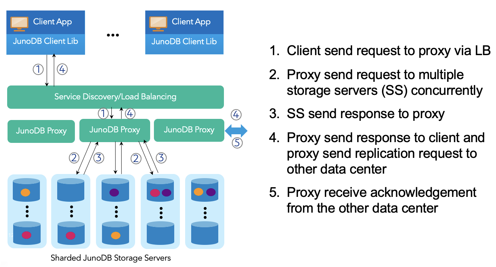

# JunoDB Architecture: A High-Level Overview
JunoDB employs a proxy-based architecture to enable horizontal connection scaling while simplifying client libraries, keeping complex logic and configurations separate from applications. Additionally, consistent hashing is utilized for data partitioning, minimizing data movement during cluster scaling. To ensure redundancy and fault tolerance, each piece of data is replicated across a group of storage nodes, with each node situated in a distinct logical zone.

  
JunoDB comprises three key components that work together seamlessly:

1. **JunoDB client library** resides in applications and provides an API that allows for easy storage, retrieval, and updating of application data through the JunoDB proxy. The JunoDB thin client library is implemented in several programming languages, such as Java, Golang, and C++, making it easy to integrate with applications written in different programming languages.
1. **JunoDB proxy** instances are driven by a load balancer and accept client requests and replication traffic from other sites. Each proxy connects to all JunoDB storage server instances and forwards each request to a group of storage server instances based on the shard mapping maintained in ETCD.
1. J**unoDB storage server** instances accept operation requests from proxy and store data in memory or in RocksDB. Each storage server instance is responsible for a set of shards, ensuring smooth and efficient data storage and management.