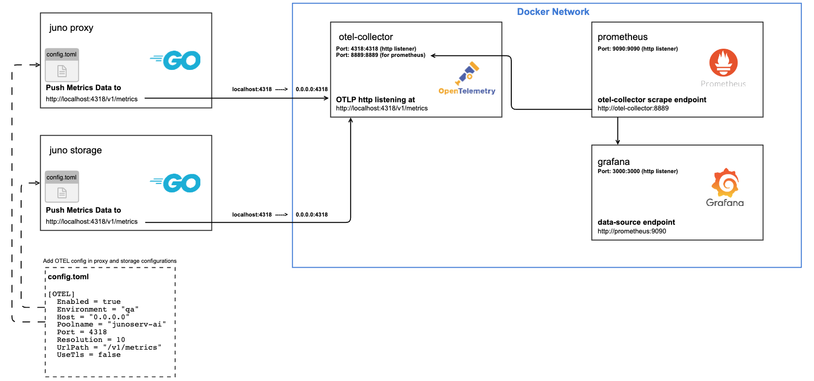
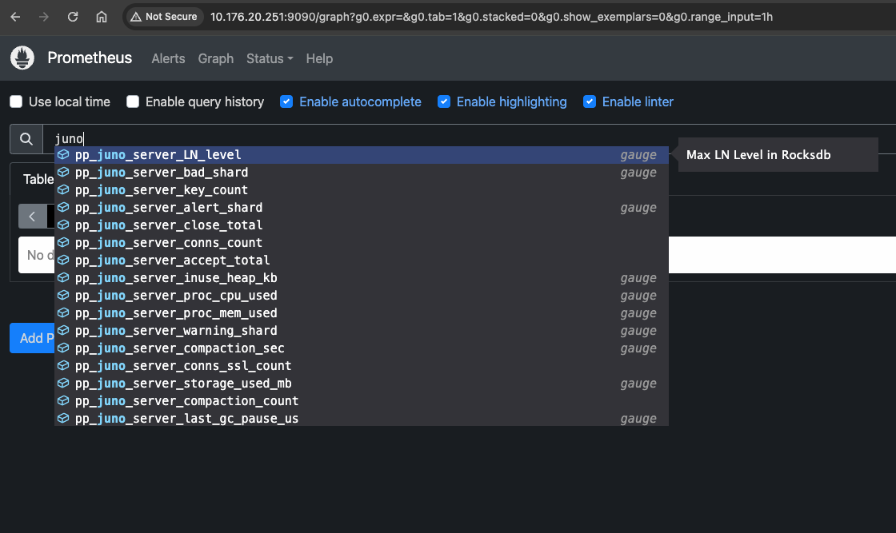

## Monitor Juno Metrics using Prometheus

#### A simple setup to push the metrics on prometheus using otel-collector is shown below. Grafana can be further used to create visualizations from the available metrics.



  #### Setup 

  ##### Configure proxy and storage to push metrics to otel endpoint

- Juno proxy and storage services are configured to push the metrics on open telemetry collector endpoint http://localhost:4318/v1/metrics . Add/Update the [OTEL] section in the respective config.toml files

```yaml
[OTEL]
  Enabled = true
  Environment = "qa"
  Host = "0.0.0.0"
  Poolname = "junoserv-ai"
  Port = 4318
  Resolution = 10
  UrlPath = "/v1/metrics"
  UseTls = false

```

- Now the proxy and storage services are uploading metrics to otel endpoint. 

##### Set up otel-collector, prometheus and grafana
- Open telemetry collector, prometheus and grafana are run as docker containers.
- otel-collector , prometheus and grafana configurations are required to be mounted as volumes in the containers
- docker-compose.yaml and configuration files for each of the services available in junodb/docker/monitoring


```bash
cd junodb/docker/monitoring

docker compose up -d
```

- Check the running containers. prometheus, otel-collector and grafana should be running

```bash
CONTAINER ID   IMAGE                                  COMMAND                  CREATED       STATUS       PORTS                                                                                                                                                       NAMES
bcb1e7ece6b7   prom/prometheus                        "/bin/prometheus --c…"   3 hours ago   Up 3 hours   0.0.0.0:9090->9090/tcp                                                                                                                                      prometheus
c3816c006f85   otel/opentelemetry-collector-contrib   "/otelcol-contrib --…"   3 hours ago   Up 3 hours   0.0.0.0:1888->1888/tcp, 0.0.0.0:4317-4318->4317-4318/tcp, 0.0.0.0:8888-8889->8888-8889/tcp, 0.0.0.0:13133->13133/tcp, 0.0.0.0:55679->55679/tcp, 55678/tcp   otel-collector
e41e33696606   grafana/grafana                        "/run.sh"                3 hours ago   Up 3 hours   0.0.0.0:3000->3000/tcp                                                                                                                                      grafana

```

- Check the promethus server running at <host_ip>:9090 as shown below. Search for juno metrics.




